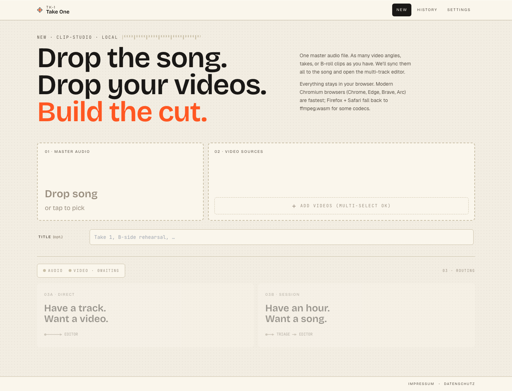
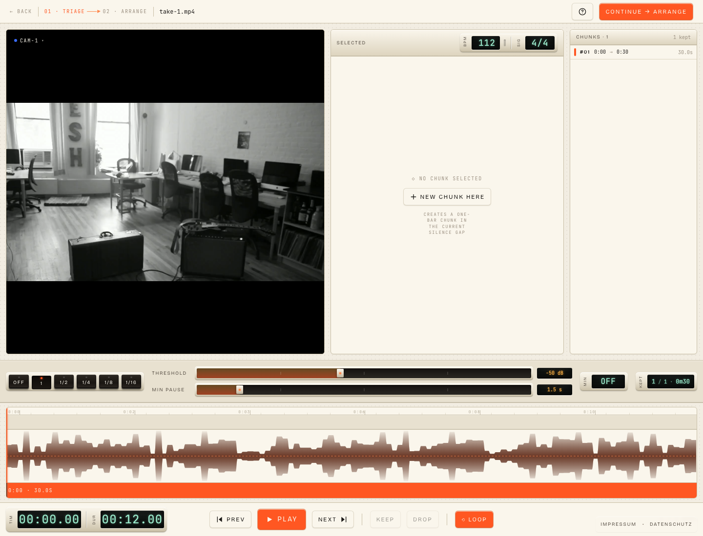
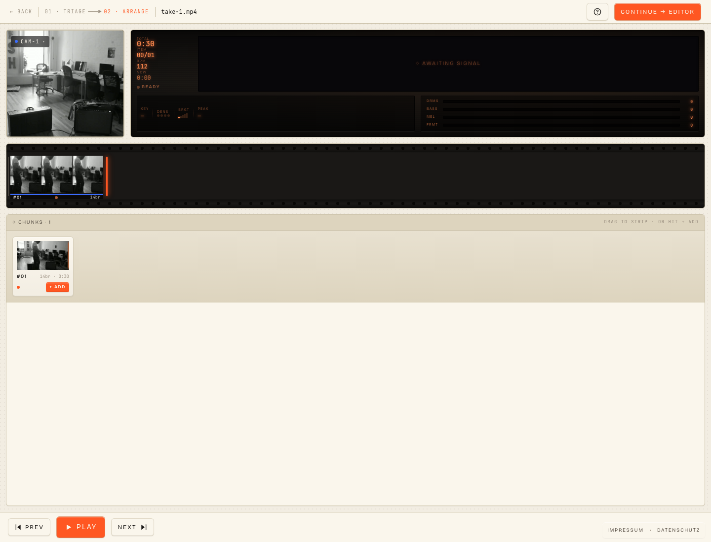
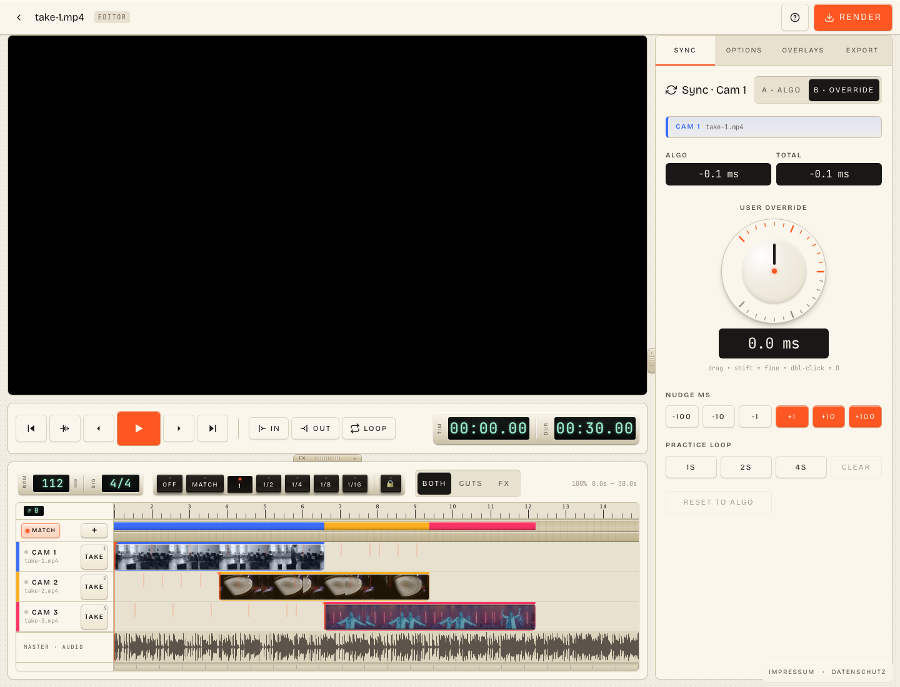
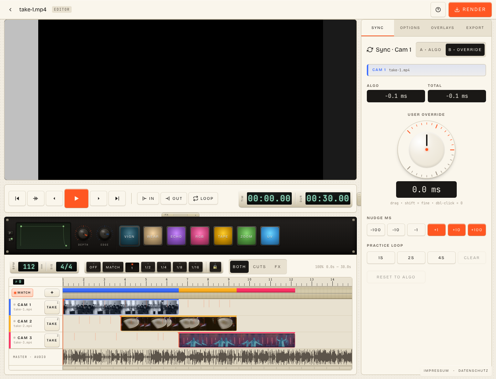

# TK-1 — Take One

**Take 1.** A small, opinionated multi-cam music video editor for
musicians who want to *play the edit*, not configure one.

Two ways in:

- **Have a track. Want a video.** Drop a finished studio mix next
  to a few phone takes. TK-1 lines every cam up to the song and
  opens the editor.
- **Have an hour. Want a song.** Drop a 90-minute jam recording.
  TK-1 finds the songs inside it, slices them into bar-aligned
  chunks, you sort the keepers on a contact sheet and sequence
  them on a 35 mm film strip — *then* play the multi-cam cut on
  top.

Either way: nothing leaves your laptop. No upload, no account; the
editor and the render run inside the browser tab.

**Live demo:** <https://tk-1.app>

<p align="center">
  
</p>

## Played, not edited

The visual language and the workflow are both shamelessly inspired
by Teenage Engineering. The OP-1, the OP-Z, the Pocket Operators:
devices that pick one job and design every surface around being
*operated*, not configured. TK-1 wants to feel the same way: a
sampler for music videos.

The loop now extends past the cuts. Picking which takes to keep
is an instrument — silence detection drops chunk boundaries, you
tap KEEP / DROP as the timeline scrubs under the playhead.
Building the arrangement is an instrument — drag Polaroids of the
chunks onto a 35 mm strip in the order you want them, with the
PlayerCockpit reading out BPM, density and a 4-band audio meter as
you scrub. *Then* hit the editor and perform your cam-switches
and FX live as the song plays.

Most "shortform video tools" are timeline editors with a phone
preset. Most "pro NLEs" put a six-pane workspace, a project file,
an asset bin and a render queue between you and a 22-second clip.
TK-1 sits between those: *that recording, those takes, one
finished video,* designed to be played live.

## How it plays

### Lining up the takes

The phone audio gets matched against the studio mix even when the
room is loud — five passes from coarse to fine, ending at
sample-perfect alignment for same-source recordings (which is what
every camera you brought is). Each cam ends up with an algorithmic
offset and three sharpness numbers — bad takes are flagged, the
rest are usable on the first try. Progress is honest now: a smooth
bar through every stage instead of the old freeze-at-40-percent.

Written in Rust, compiled to WASM, runs inside the page. Curious
about the five passes? See [under the hood](#under-the-hood).

### Triage — find the songs in the jam

If you came in through the SESSION door, the editor has a 90-minute
recording in front of it and no idea where the songs sit. Triage
runs silence detection across the whole thing, drops chunk
boundaries wherever it finds them, and hands you a rack: cam
preview, inspector with a brass-plate BPM and signature plate,
scrolling list of the chunks it found, KEPT counter on the right
that updates live as you accept or drop. The DeckStrip across the
middle sets the silence threshold and the minimum-pause length —
one slider each, no dialog. Scrub the timeline, tap KEEP or DROP
chunk by chunk.

<p align="center">
  
</p>

### Arrange — build the cut on a film strip

Accepted chunks become Polaroids on a contact sheet, ordered as
they were recorded. Drag them up onto the 35 mm film strip in
whatever order you want them in the final video — repeats,
re-orderings, dropouts, all by drag. The PlayerCockpit on top is
a CRT LCD with the running TOTAL / current IDX / BPM / NOW
readout plus a 4-band audio meter (DRMS · BASS · MEL · FRMT) and
KEY / DENS / BRGT / PEAK glance reads as you scrub the strip. The
MiniMap appears when the strip overflows the visible row.

<p align="center">
  
</p>

### Snap to the bar, or to where the take actually is

Beat detection runs on the master audio and gives you a real beat
grid: 4/4 by default, configurable, with a bar-1 pickup so the
grid lines up with the *song* and not with sample 0. Quantize
down to sixteenth notes, up to whole bars. And the beat picker
doesn't double-time slow songs anymore.

When you drag a clip on the timeline, snap goes to the grid or to
the audio-match positions where the take itself plays a downbeat.
So you're not snapping to "the nearest beat"; you're snapping to
"the place where the take actually plays the downbeat."

<p align="center">
  
</p>

### Cam keys: tap to cut, hold to paint

`1`–`9` are your cam pads. Tapping a number drops a single cut at
the playhead to that cam. Holding it paints that cam over the lane
while the song plays under your finger. Cuts are exclusive: one cam
at a time, by design — that's what a cut *is* — and they live on a
dedicated CUTS rail you can solo with the `BOTH` / `CUTS` / `FX`
mode picker.

There's no asset bin, no nested timelines, no "create a sequence."
There's a **MASTER · AUDIO** track at the bottom, one lane per cam
above it, and number keys.

### Punch-in FX, on a pad bank

A separate FX rail above the cam lanes, with seven pads: **VIGN,
WEAR, ECHO, RGB, TAPE, ZOOM, UV** — each a real shipping renderer
with WebGPU, WebGL2 and Canvas2D backends, parity-checked. Hold a
pad while the song plays to paint that effect under your finger;
release to drop the tail. FX stack — they don't replace each other.

Below the rail sits a hardware-style panel: a CRT-green LCD, two
small `P` / `E` plastic buttons on its left edge (parameters vs.
envelope), a TE-orange DEPTH encoder and a TE-cobalt EDGE encoder,
and the seven pads again. The encoders are the kind's two
parameters and are live — turning a knob during playback or
preview reflects in the rendered frame immediately, no re-trigger.

Each FX gets an ADSR envelope on top of its parameters. Hit `E`,
the LCD switches to a phosphor trapezoid; drag the four green
knots to shape attack, decay, sustain and release. Releases fade
from wherever the envelope was when you let go, even mid-attack —
feels like a real synth voice, not a fader.

<p align="center">
  
</p>

While paused, the pads switch to **audition mode**: clicking (or
hitting the keybind) latches a live preview of that kind on the
playing frame, so you can dial DEPTH and EDGE with the encoders
and watch the result without committing anything to the timeline.
Click again to drop the latch, click another pad to swap.

`X` is the eraser. While playing it wipes FX under the playhead;
combine with a pad key (`X+V`, `X+W`, …) to wipe only that kind.
While paused, holding `X` for three seconds clears the program
strip wholesale.

### Transport you can play

`L` arms a 2-second loop region at the playhead — orange shading
on the bar ruler and the audio waveform. `I` and `O` set the
in-point and out-point; they re-aim depending on what's selected:
loop active → loop ends, video clip selected → that clip's source
trim, image clip selected → its master-time edges, otherwise the
master export region. `Alt+←` and `Alt+→` shift the loop by its
own length with a gapless wrap (sample-accurate crossfade, not a
`currentTime` seek). Snap-aware arrow keys step to frame /
match-point / beat / bar depending on the active snap mode.

Tap `?` for the cheat sheet — every shortcut auto-registers itself
in the overlay so the list never lies to you.

### Output frame, stage, framing

Pick a Stage shape — **WEB** (16:9 at 1920×1080), **MOBILE**
(9:16 at 1080×1920), **ARCHIVE** (your aspect at H.265 / pristine
quality), **CUSTOM** (any combination). Each clip then carries
its own viewport over the Stage: drag in the preview to pan,
wheel to zoom, double-click to reset, hold Alt for 5× precision.
Four orange L-corner marks anchor the active clip's bounds, even
when they overflow the Stage. Preview and export use the same
math — what you see is what renders.

Static images sit alongside videos on the timeline with the same
framing controls and the same routing.

### Browser is the runtime

WebCodecs does the heavy lifting. ffmpeg.wasm sits in the back of
the cupboard for codecs WebCodecs doesn't reach. Multi-GB session
files stream in 4 MiB batches so the tab doesn't sit on a 9 GB
heap. If your browser supports it, the editor remembers the *file
handle* — re-open a job and TK-1 reads the originals from disk,
no copy. On Safari and Firefox we keep an OPFS copy.

Render runs through a single pipeline now: the same WebGPU →
WebGL2 → Canvas2D ladder that drives live preview drives the
encoder. About realtime on a recent laptop with WebGPU.

## Privacy

There's no backend. The host nginx terminates TLS, the container's
nginx serves the static SPA bundle, and that's the entire server.
Phone video, studio audio, and your edits all live in your
browser's OPFS and IndexedDB — or, where the browser supports it,
in the *original files on your disk* via native file handles, with
the editor only holding a reference. To wipe a job, click its
trash icon. There's nothing to delete server-side.

Nothing leaves the browser, and nothing third-party gets loaded
into it. No analytics in the bundle, no cookies, no fonts pulled
from a CDN — `@fontsource-variable/*` bundles them locally.

## Browser support

- **Chrome, Edge, Brave, Arc** on desktop and Android: WebGPU
  preview and export, WebCodecs decode/encode, native file handles
  via the File System Access API. Fastest tier.
- **Firefox, Safari** (incl. iOS Safari 17.4+): WebGL2 preview,
  ffmpeg.wasm fallback for codecs that aren't native, OPFS copy
  for files (you re-pick them on every open).

Mobile is a real surface — the on-screen TAKE buttons do what the
number keys do on desktop, the FX hardware panel re-flows so the
LCD sits above the encoders and pads, and the ADSR knots have an
enlarged tap-zone. Drop a couple of takes on your phone, sync,
perform the cuts, render — all from there.

The app needs cross-origin isolation (COOP/COEP) for
SharedArrayBuffer and threaded codecs.

## Architecture

```
Browser (everything runs here)
├── Sync                Rust → WASM (frontend/wasm/sync-core)
│   └── 5-tier pipeline envelope → chroma+onset → phase-correlation
│                       → salient-anchor consensus → drift
├── Codec layer         WebCodecs primary, ffmpeg.wasm fallback
├── Media loading       streaming demuxers (4 MiB batches),
│                       native file handles | OPFS fallback
├── Triage              silence-driven chunking + per-chunk BPM
├── Arrange             film-strip arrangement + Polaroid contact sheet
├── Render              single pipeline, preview == export,
│                       WebGPU → WebGL2 → Canvas2D
├── FX                  seven-pad bank, three backends per kind,
│                       event-based ADSR envelopes
├── Stage               explicit output frame + per-clip viewport
├── Subtitle burn-in    custom Canvas2D ASS-subset renderer
├── Visualizers         showwaves, showfreqs, others
├── Storage
│   ├── OPFS            raw video/audio when no native handle
│   └── IndexedDB       job metadata, sync results, edit specs,
│                       per-chunk thumbnails + mel-specs
└── UI                  React + Zustand + Canvas timeline

Server (just hosting)
└── nginx + static SPA bundle (Dockerfile + deploy/nginx.conf)
```

## Under the hood

For the curious — this section is where the jargon lives. The
prose above stays clean.

### Sync pipeline

Five tiers, coarse to fine:

1. **Envelope** — RMS-envelope cross-correlation at 10 Hz. Robust
   against mic EQ, room reverb and codec artifacts. Provides a
   coarse seed and a search corridor for later stages.
2. **Chroma + onset** — pitch-class fusion plus spectral-flux,
   running inside the envelope corridor.
3. **Phase correlation** — GCC-PHAT in a 20 s window for
   sample-precise refinement. Phase-only correlation excels at
   same-source multi-mic alignment.
4. **Salient-anchor consensus** — picks K spectrally-unique
   8 s windows in the cleaner track, runs sample-level phase
   correlation on each within ±2 s, bucket-votes the offset.
   Replaces uniform chunking; immune to bar-shifted impostors.
5. **Drift correction** — per-window refinement against
   sample-rate slop.

Each cam surfaces three sharpness numbers — peak-to-second-ratio,
peak-to-noise, and the phase-coherence reading — plus a percentage
confidence and a per-stage progress bar.

### Tempo prior

Beat detection multiplies the autocorrelation by a Rayleigh prior
centered at 110 BPM (Klapuri / Davies-style perceptual-tempo
weighting). Lo-fi tracks at 85 BPM no longer get pushed into the
170 BPM octave by the off-beat hi-hats.

## Local development

```bash
cd frontend
npm install --legacy-peer-deps
npm run dev               # http://localhost:5173 with COOP/COEP headers
```

Production bundle:

```bash
cd frontend
npm run build             # → dist/
npm run preview           # serve dist/
```

You need:

- Node 20+
- Rust stable plus the `wasm32-unknown-unknown` target and
  `wasm-pack`
- A modern Chromium (Chrome, Edge, Brave, Arc) for the browser
  tests

## Tests

Three runners; see [TESTING.md](TESTING.md) for the strategy:

```bash
cd frontend
npm run test              # vitest in jsdom (pure functions, components)
npm run test:browser      # vitest in real Chromium via Playwright
                          # (WebCodecs, OPFS, ffmpeg.wasm, end-to-end
                          #  render + ASS overlay verification)
npm run wasm:test         # cargo test on the Rust sync-core
```

## Self-hosting

Imprint config, nginx setup and DE compliance notes live in
[DEPLOY.md](DEPLOY.md).

## License

[MIT](LICENSE), do whatever, no warranty.

The browser-side ffmpeg.wasm fallback is loaded under LGPL v2.1+
(<https://ffmpeg.org>, <https://github.com/ffmpegwasm/ffmpeg.wasm>);
the unmodified source is available at those upstream links.
